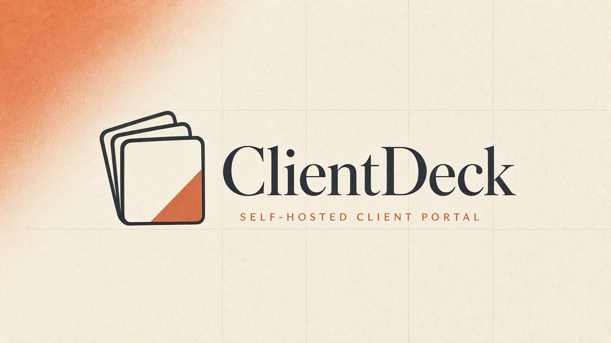
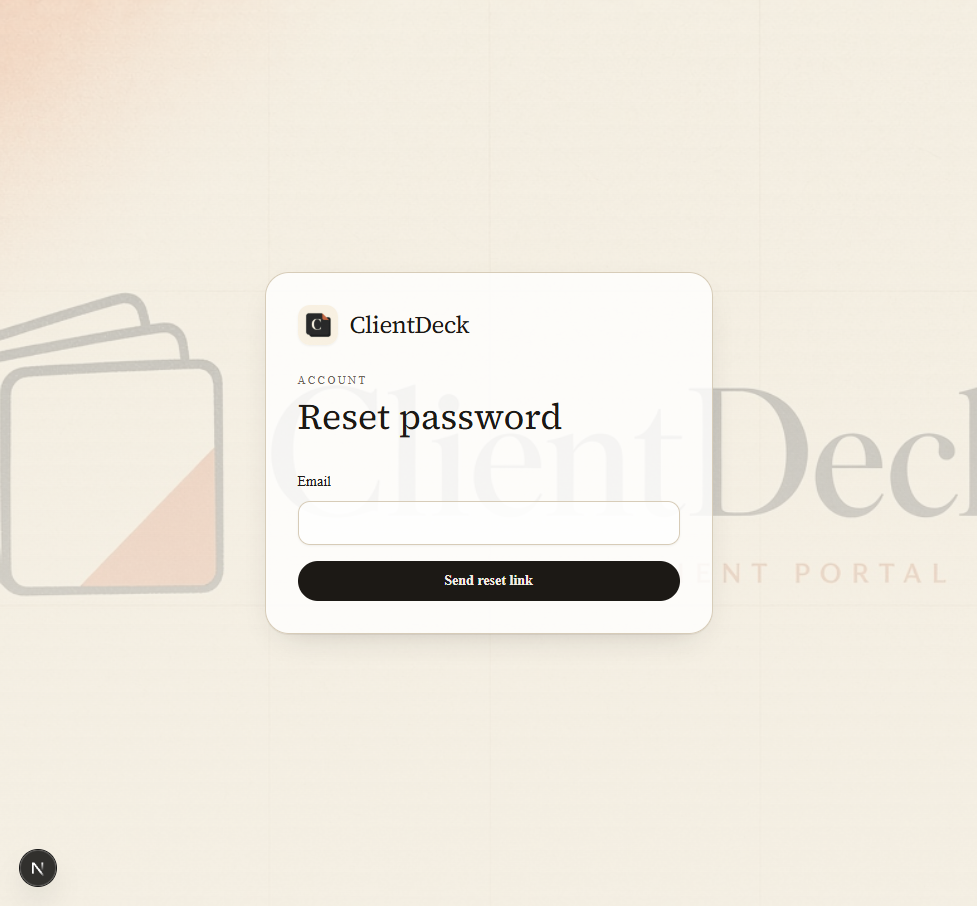
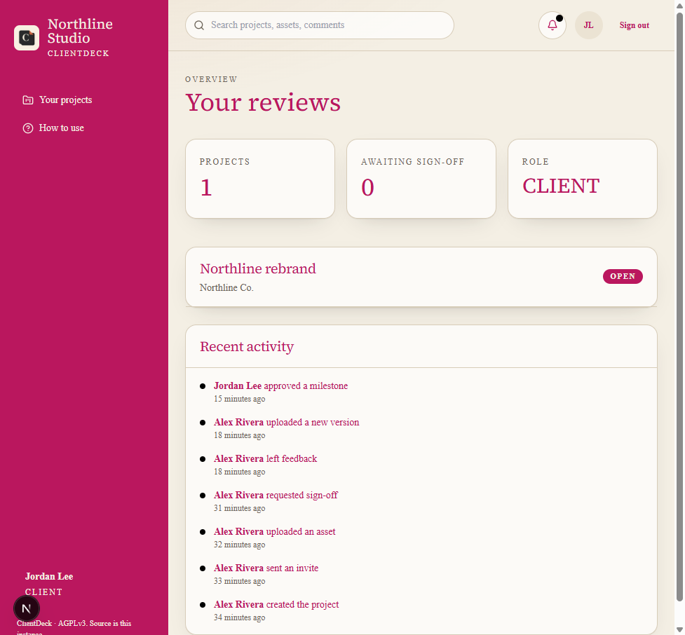
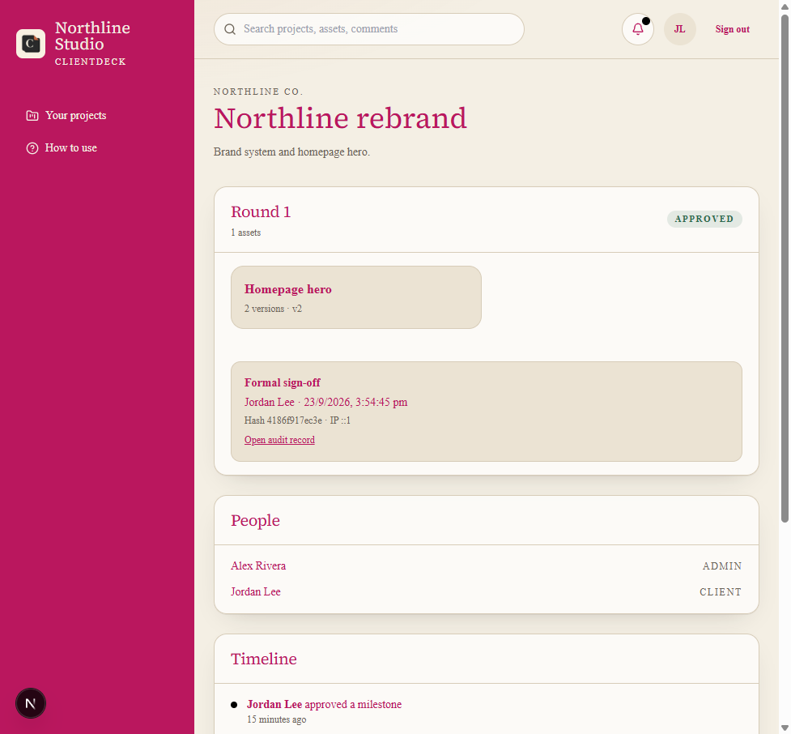
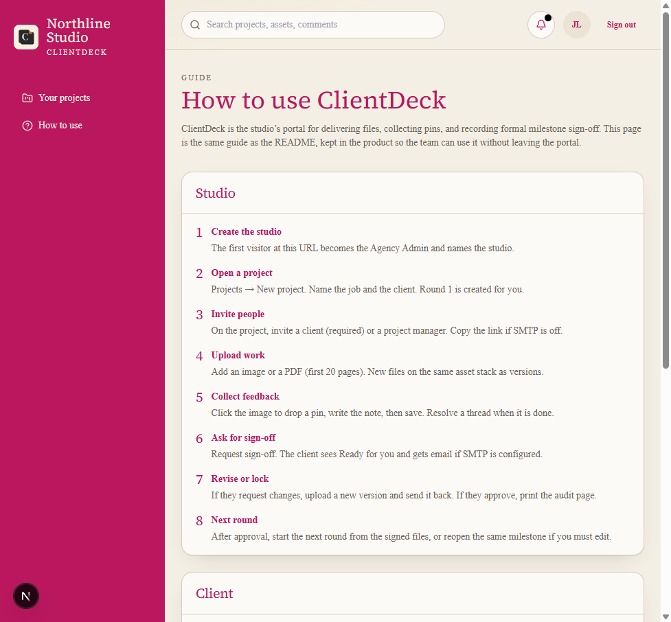
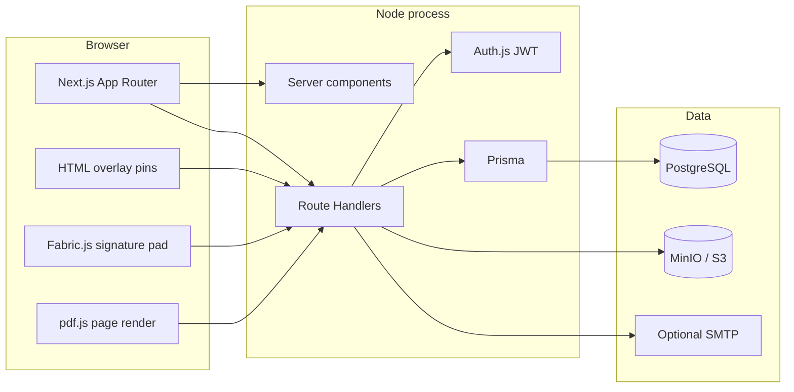

<p align="center">
  
</p>

<p align="center">
  
</p>

<h1 align="center">ClientDeck</h1>

<p align="center">
  Open-source, self-hostable client portal for design studios and consultancies.<br />
  One place for <strong>asset delivery</strong>, <strong>inline pins</strong>, and <strong>formal milestone sign-off</strong>.
</p>

<p align="center">
  
  
  
</p>

This Alpha is a single Next.js app (UI + Route Handlers), PostgreSQL, and MinIO — one Docker Compose stack instead of a split frontend/backend.

License: [AGPLv3](./LICENSE). In-app guide: sidebar → **How to use**. Operator notes below. Handbook copy: [docs/USER_GUIDE.md](docs/USER_GUIDE.md).

---

## Screenshots

Live Northline Studio walkthrough (client session after sign-off). Open the running app to read the type — some capture tools smear variable fonts.

| Auth + brand | Client desk |
|---|---|
|  |  |

| Approved milestone | How to use |
|---|---|
|  |  |

---

## What you can do

- First-run studio setup and email/password accounts (Auth.js). No Clerk.
- Password reset (email if SMTP is set, otherwise a copyable link)
- Roles: **Agency Admin**, **Project Manager**, **Client Viewer**
- Invite links with copy, 14-day expiry, and revoke
- Projects, milestones, optional due dates, archive
- Image + PDF page upload (first 20 pages), version stacking, Then / Now / Compare
- Pins and comment threads on a version: draft-then-save, edit, delete, **resolve**
- Client can **approve** or **request changes**
- Studio can **reopen** an approved milestone or **start the next round** from the signed files
- In-app activity, notification bell, and header search
- Sign-off: clickwrap + typed name + optional drawn signature + printable audit record
- White-label: studio name, logo, primary and accent colors (ClientDeck mark is the default)
- Optional SMTP for invites, password reset, review, comments, changes, and approval
- Time-limited S3 URLs and an authenticated file proxy
- Rate limits on setup, login, invites, and password reset
- `GET /api/health`

**Not in this Alpha:** video comments, custom domains, multi-tenant cloud, certified e-sign (eIDAS / ESIGN).

Sign-off creates a **formal audit trail**. It is not a certified electronic signature unless your counsel says your use of the record meets those rules.

---

## Who uses it

| Role | What they do |
|---|---|
| **Admin** | Creates the studio, branding, every project, invites anyone, archives/deletes projects |
| **Project manager** | Works on assigned projects: upload, request sign-off, start the next round |
| **Client** | Sees only invited projects, leaves pins, requests changes, or approves |

---

## How a studio runs a job

1. Open the site. The first visitor becomes Admin and names the studio.
2. **New project** — job name + client name. **Round 1** is created automatically.
3. On the project, **invite the client**. If SMTP is off, use **Copy link**.
4. Upload an image or PDF. Extra files on the same asset become **v2, v3…**
5. Click the image, write the note, **Save pin**. Resolve the thread when it is done.
6. **Request sign-off**. The client gets **Ready for you** (and email if SMTP is on).
7. If they **request changes**, their note appears on the milestone. Upload a new version and **Send back for sign-off**.
8. If they **approve**, open **Audit record** → **Print / save PDF**.
9. **Start next round** copies the signed files into a new draft milestone. **Reopen for edits** unlocks the same milestone without deleting the old audit row.

Optional: set a due date when you add a milestone. Archive a finished project from the project header. Search the header for project, asset, or comment text.

---

## How a client reviews

1. Open the invite link. Set a name and password.
2. On the dashboard, open **Ready for you** → **Review and sign off**.
3. Check each asset. Use **Then / Now / Compare** when there is more than one version. Pins stay on the version they were left on.
4. Either:
   - **Request changes** — write what must be fixed. The studio revises and asks again.
   - **Approve** — tick the agreement, type your full legal name, optionally draw a signature.

After approval the milestone is locked until the studio reopens it or starts the next round.

---

## Design

ClientDeck is meant to feel like a studio desk, not a SaaS dashboard.

| Token | Value | Use |
|---|---|---|
| Ink | `#1c1915` | Type, sidebar, primary buttons |
| Paper | `#f4efe4` | Page ground |
| Accent | `#c45c26` | Actions, pins, waiting states |
| Studio override | Org `primaryColor` / `accentColor` | Live CSS variables (`--ink`, `--brand-accent`) |

Type: **Source Serif 4** for titles, **Source Sans 3** for UI. The default mark is a stacked-card **C** (`public/brand/clientdeck-logo.png`) on the editorial hero (`public/brand/clientdeck-hero.png`). Auth screens use that hero as the background. A studio can replace the sidebar mark from **Studio settings**.

Source files:

- Logo: [docs/brand/clientdeck-logo.png](docs/brand/clientdeck-logo.png)
- Hero: [docs/brand/clientdeck-hero.png](docs/brand/clientdeck-hero.png)
- Favicon: [public/favicon.svg](public/favicon.svg)

---

## Tech stack



| Layer | Choice | Why |
|---|---|---|
| App | Next.js 15 App Router + TypeScript | One deployable for UI and APIs |
| Style | Tailwind + CSS variables | Studio white-label without a theme rebuild |
| Auth | Auth.js v5 credentials + JWT | Self-host, no Clerk |
| Data | Prisma + PostgreSQL 16 | Projects, pins, immutable approvals |
| Files | MinIO (S3 API) | Presigned PUT, authenticated proxy |
| Mail | nodemailer, optional | Invites, reset, review pings |
| Sign | Fabric.js | Drawn signature only |
| PDF | pdfjs-dist | First 20 pages as images |
| Run | Docker Compose | `db` + `minio` locally; `web` profile for full stack |
| Checks | `tsc`, ESLint, Playwright smoke, GitHub Actions | Prisma validate + types + lint on PRs |

---

## Quick start (local)

You need **Node 20+** and **Docker** (Postgres + MinIO).

```bash
docker compose up db minio -d
cp .env.example .env
npm install
npx prisma migrate deploy
npm run dev
```

Open [http://localhost:3000](http://localhost:3000). The first visitor creates the studio admin.

- App: http://localhost:3000
- MinIO console: http://localhost:9001 (`clientdeck` / `clientdecksecret`)
- In-app guide: sidebar → **How to use**

## Full stack Docker

```bash
docker compose --profile full up --build
```

The `web` service runs migrations on boot and serves port 3000.

## Checks

```bash
npx tsc --noEmit
npm run lint
npm run test:e2e
```

CI runs Prisma validate, TypeScript, and lint on pull requests.

---

## Environment

Copy [.env.example](./.env.example). `AUTH_SECRET` must be at least 16 characters.

| Variable | Purpose |
|---|---|
| `DATABASE_URL` | PostgreSQL |
| `AUTH_SECRET` | Session signing. Generate a long random string in production. |
| `APP_URL` / `AUTH_URL` | Public origin used in invite, review, and reset links |
| `S3_*` | MinIO or any S3-compatible store |
| `S3_PUBLIC_ENDPOINT` | Browser-reachable origin inside presigned URLs |
| `SMTP_*` | Optional mail. If unset, invite and reset links are shown in the UI to copy. |

### SMTP (optional but recommended)

When `SMTP_HOST` and `SMTP_FROM` are set, ClientDeck emails:

- Invite and password-reset links
- Client: sign-off requested
- Studio: changes requested, milestone approved
- Project members: new pin or comment

Without SMTP, those same events still appear in the activity feed and notification bell.

---

## Production checklist

1. Put the app behind HTTPS. Set `APP_URL` and `AUTH_URL` to that origin.
2. Replace `AUTH_SECRET` with a long random value. Never commit `.env`.
3. Use managed Postgres or keep automated dumps of the `clientdeck` database.
4. Back up the MinIO / S3 bucket (`assets/` and `signatures/`). Files are not in Postgres.
5. Rate limits are **in memory** on each Node process. Fine for a single container; not shared across a fleet.
6. Restrict the MinIO console (port 9001) to your network. Clients only need the app origin.
7. Confirm `GET /api/health` returns `{"ok":true,"db":true}` from your load balancer.

### Backups (example)

```bash
docker compose exec db pg_dump -U clientdeck clientdeck > backup.sql
# copy the MinIO data volume or sync the bucket to cold storage
```

Restore with `psql` and `npx prisma migrate deploy` before starting the app.

---

## Roles and legal note

Approval stores: typed name, time, IP, user agent, agreement text, SHA-256 of that text, and the exact asset version IDs. The audit page is the record you print or save.

This is a **formal project sign-off and audit trail**. It is not a certified electronic signature under eIDAS, the U.S. ESIGN Act, or similar statutes unless your own counsel advises that your use of this record meets those requirements.

---

## Release

Current tag: **v0.2.0** — review workflow (request changes, resolve threads, email pings, next round), brand mark, and this handbook.
